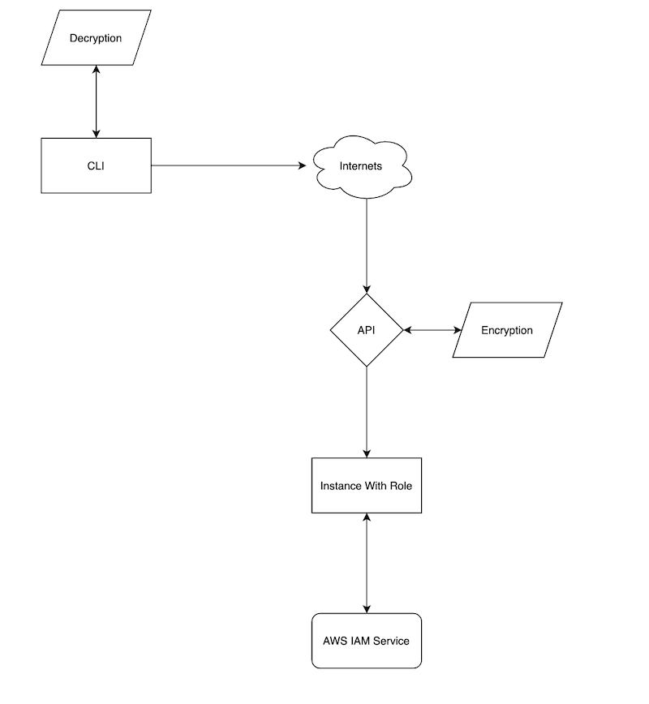

# Smuggler
Smuggler is a api and cli service set that allows you to impersonate a ec2 instance as that instances right down to its permissions.
This could be used a framework for a secure way to send infomration back and fourth between a user and aws. 

## To Use
You will want to look at the terraform-example. This will spin up the whole infrastructure and give you the outputs you will need for the config.json file 
that is needed by the cli tool. As its connects over the the http(s) protocol. You will need to setup shared cyphers inorder to be certain that you can encrypt and
decrypt the messages sent between the api and cli tools. 

## Diagram

